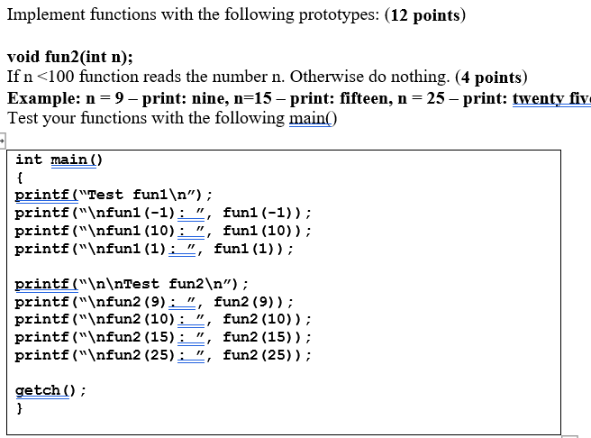
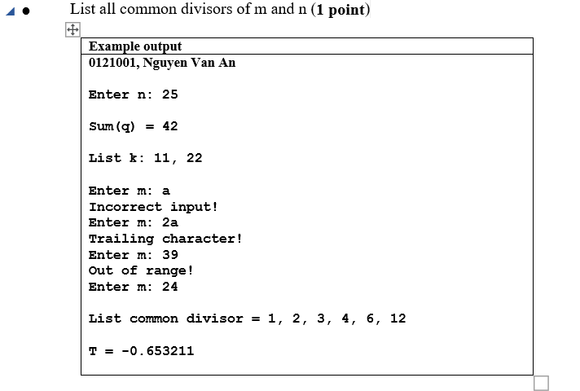

# (NON)Practical Examination Paper

## How are you going to compile this code ????

please give compiler binary and instructions

## What the logic

divisor of 24 is 1, 2, 3, 4, 6, 12, 24

divisor of 25 is 1, 5, 25

So, common divisor of 24 and 25 equals 1
